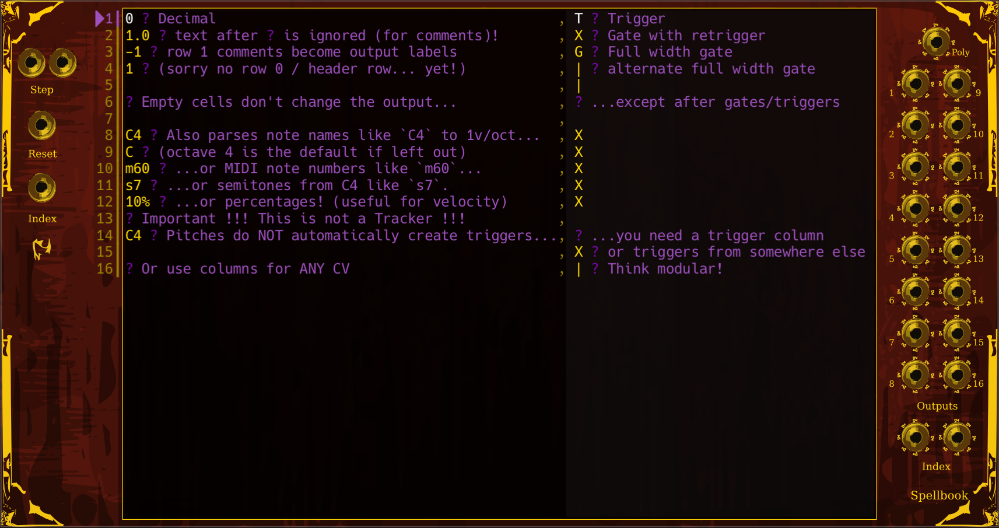

# T's Musical Tools
A collection of esoteric VCV Rack modules.

Many are focused around seedable RNG, and/or routing polyphonic signals in useful ways such as shuffling, sorting, joining, or selecting subsets of them.

Spellbook is a sequencer which uses a plaintext, "tracker like" notation, specifically created for a modular environment, and designed to be easily written, edited, and copy & pasted.

Mostly these modules are useful for routing signals and/or working with control voltages, as opposed to generating audio, but most do have the option to run at audio rate if they normally don't (for mad science purposes).

## Where to Get It:

- Download from the [VCV Rack Library plugin page](https://library.vcvrack.com/TMT) (*recommended*)
- *Or,* check [Releases](https://github.com/Jadael/TMT/releases) to install the latest release or to [install the latest preview](https://vcvrack.com/manual/Installing#Installing-Rack-plugins)

## The Modules
- [Calendar](#calendar) - Output LFO-like signals based on local time and day, creating rising sawtooths synced with seconds, minutes, hours, days, through to years. Loosely inspired by Aria Salvatrice's "Arcane" module (try sampling Calendar as your RNG seed source!)
- [Sight](#sight) - A scope where time slows down over the width of the scope, letting you see a signal over different time scales simultaneously.
- [Seed](#seed) - Get 16 random numbers, with an option to provide an RNG seed.
- [Shuffle](#shuffle) - Randomly re-order the channels of a polyphonic signal, with an option to provide an RNG seed.
- [Ouroboros](#ouroboros) - Step through the channels of a polyphonic signal as a sequence. Try using Seed as your sequence source! Maybe Shuffle it every two bars?
- [Append](#append) - Combine the channels of up to 16 mono or polyphonic cables (i.e. append the multiple lists together into one big list; up to a total internal buffer of 128 channels), then output a 1 to 16 channel subset of them, with CV controls for width and starting point.
- [Stats](#stats) - Get statistical measures like mean, median, mode, product, etc. of the channels of a polyphonic signal, inspired by spreadsheet functions like AVERAGE(), MEDIAN(), SUM(), etc.
- [Sort](#sort) - Sort and select channels from a polyphonic cable using other polyphonic CV inputs, inspired by spreadsheet functions like RANK(), FILTER(), UNIQUE(), etc.
- [Spellbook](#spellbook) - Plain text "musical markup" sequencing of CVs/pitches, with a broad variety of accepted formats for however you want to write your sequences; such as pitch names, MIDI note numbers, semitones, Hertz, etc. Write out sequences in rows and columns like a spreadsheet!

## Getting Started

The modules might look a little intimidating, because there no knobs in these modules, only jacks. Everything is controlled via CV inputs. But don't worry, they're all very small, focused modules that will make sense once you use them.

Mostly these fall into four big camps, with lots of overlap:

- creating or getting "interesting" control voltages
- routing polyphonic signals and control voltages through your patch in complex ways
- seedable randomization
- *Spellbook*

Whenever RNG is used, there's always an input for the RNG seed for repeatabilty, which is often musically useful.

None of them *generate* audio, unless you use them ~~wrong~~ like a modular synth player. (Try Indexing Spellbook with an oscillator instead of a phasor!)

You'll want to jump into these with a good understanding of how polyphonic cables work in VCV Rack, especially the built-in Merge and Split modules, and have ready your prefered methods of generating and/or sampling & holding specific voltages.

This plugin pairs well with [computerscare modules](https://library.vcvrack.com/computerscare) (which also play a lot of polyphony and random generation), [SIM modules](https://library.vcvrack.com/SIM) (the Coerce module lets you quantize to a polyphonic signal, which opens up a lot of fun ways to dynamically generate what you're quantizing *to*), and [HetrickCV's Phasors](https://library.vcvrack.com/HetrickCV) (Spellbook's Index feature works well with phasor inputs), and in general any modules which like to handle polyphonic cables and/or have CV controlled parameters. Check out [stoermelder](https://library.vcvrack.com/Stoermelder-P1) for modules which let you control *anything* in VCV Rack with CV, even when there's not a CV input jack implemented.

---

# Calendar

Calendar generates a set of very slow LFO-like signals representing the progress through various time/calendar units. The module outputs voltages ranging from 0 to 10v, where each voltage corresponds to the current "progress" through the respective time unit.

- Ramps, triggers, and gates for seconds, minutes, hours, days, weeks, months, seasons, and years
- Voltages range from 0 to 10v
- Alt Mode: Use UTC time instead of Local time.

Loosely inspired by Aria Salvatrice's "Arcane" module, which gave a new random set of pitches and rhythms each day, and gave everyone everywhere the same set each day, so you could all share this same source of RNG and inspiration in many diverse patches. Making patches with Arcane made me imagine patches which sync up to the days and seasons, which led to Calendar, which was both my first module made for this plugin and my first ever C++ project.

## Outputs
Each time unit has a row of five outputs:

1. Linear Ramp: A smooth, continuous voltage ranging from 0 to 10v, representing the progress through the time unit.
2. Stepped Ramp: A stepped version of the smooth output, dividing the progress into equal intervals based on how that time unit is traditionally subdivided:
   - Second: 4 steps
   - Minute: 60 steps (seconds)
   - Hour: 60 steps (minutes)
   - Day: 24 steps (hours)
   - Week: 7 steps (days)
   - Month: 4 steps (weeks)
   - Season: 3 steps (months)
   - Year: 12 steps (months)
3. Trigger: Sends a 10v trigger signal for 1ms at the beginning of each time unit cycle.
4. Gate: Outputs 10v for the first half of the time unit cycle and 0v for the second half.
5. Inverse Gate: The opposite of the Gate output, 0v for the first half and 10v for the second half of the cycle.

## Usage Guide

Calendar offers a unique way to sync your patches with real-world time. It's like having LFOs that align with the passage of time on your computer's clock. Here's how to use it:

1. Connect any of the outputs to CV inputs on other modules. For example, you could use the Day Linear Ramp to slowly modulate a filter over the course of a day.

2. Use the Trigger or Gate outputs to affect or trigger events at the start of each time unit. Maybe a new section starts every minute?

3. Click the toggle switch at the top of the module to switch between local time (default) and UTC. This can be useful for synchronizing patches across different time zones.

Calendar updates in real-time based on your computer's clock, so it's perfect for long-running, evolving patches or installations that change over extended periods.

---

# Sight

Sight is a logarithmic oscilloscope for visualizing voltage signals in VCV Rack. Unlike traditional scopes, Sight displays time non-linearly across its horizontal axis, allowing you to observe both rapid changes and long-term trends simultaneously.

## Key Features:

- Non-linear time display: The rightmost edge shows the most recent sample, with time stretching logarithmically towards the left.
- Voltage range: Displays signals from -10v to +10v vertically.
- Variable update rate: Toggle between a default 1kHz refresh rate and full audio rate processing.

## Inputs & Outputs
- **Toggle Audio Rate**: By default, Sight updates at 1kHz. Toggle this to process at audio rate (CPU intensive).
- **Voltage Input**: Connect any voltage source to this input to display its waveform on the scope.

## How It Works:

1. The scope continuously samples the input voltage, storing 8192 samples in a circular buffer.
2. The display maps these samples across the width of the scope:
   - The rightmost pixel represents the most recent sample.
   - Each pixel to the left represents an exponentially increasing time span.
   - The leftmost pixel shows the oldest sample.

3. They aren't placed uniformly; the logarithmic time scale means the horizontal axis is warped:
   - Recent changes appear more spread out on the right side.
   - Older signal history is compressed towards the left side.
   - It's sort of like the zoom level is different at each point along the timeline, so you see all zoom levels simultaneously.

## Visual Interpretation:

- Faster patterns in the signal will be easier to see on the right.
- Slower changes or overall trends become apparent towards the left.

## Usage Guide:

1. Connect any voltage source to the input.
2. Observe the unique perspective on your signal:
   - Instantaneous changes
   - Short-term patterns
   - Long-term voltage trends

3. Toggle the "Alt Mode" switch for audio-rate processing if needed, but be aware this is more CPU intensive.

Sight is particularly useful for visualizing complex modulation sources, envelopes with long release times, or signals with both fast and slow components. It provides a unique view of your patch's voltage behavior over multiple time scales simultaneously.

---

# Seed

Seed is a static random voltage generator with 16 individual outputs and a polyphonic output. It generates the values based on an input voltage used as a seed for the random number generator, so you can return to the same seed/pattern if desired, or you can supply a randomly generated seed for a totally random pattern.

## Key Features
- 16 individual random voltage outputs
- Polyphonic output with 16 channels
- Seed-based random voltage generation
- Alt Mode: Snap outputs to 0v or 10v (useful for generating gate patterns)

## Inputs and Outputs
- **Seed Input**: Voltage used as the seed for random number generation. If no input is connected, a random seed is used.
- **Poly Out**: Polyphonic output with 16 channels containing the generated random voltages.
- **Out 1 - Out 16**: Individual outputs for each of the 16 random voltages generated.

## How It Works
1. The module reads the voltage from the Seed input (or uses a random value if unconnected).
2. It uses this seed to initialize a random number generator.
3. The generator produces 16 random voltages between 0v and 10v.
4. These voltages are output individually and as a polyphonic signal.

## Usage Guide
Seed is designed for creating reproducible randomness in your patches:

1. **Basic Usage**: Leave the Seed input unconnected, and it boots up with a randomly generated seed, giving you 16 static random voltages, each between 0 to 10.
2. **Controlled Randomness**: Connect a stable voltage to the Seed input to get a consistent set of random voltages. Connecting or changing this voltage will produce a new set of random values. Going back to the same voltage, generates the same values.
3. **Evolving Patterns**: Use an LFO or sequencer to modulate the Seed input for evolving random patterns.
4. **Gate Generation**: Enable Alt Mode to turn Seed into a random gate generator, outputting only 0v or 10v.
5. **Sequence the Seed**: If you send a sequence of seed values, you'll get a series of "random patterns" that loops back around and does the same random patterns again, making it a breeze to incorporate random but intentional-feeling modulations to your patches.
6. **Correlate Modulations**: Connect a Seed to an existing CV somewhere in your patch, and you get 16 new CVs that change along with that CV, in surprising but consistent ways. For example, maybe your effects all get modulated differently for each note in your melody, but it's always the same for the same note.

## Alt Mode
Click the toggle switch at the top of the module to activate Alt Mode. In this mode, instead of outputting voltages across the full 0-10v range, Seed will round each output to 0v or 10v, effectively turning it into a random gate generator.

Seed is perfect for adding controlled randomness to your patches. Use it to generate random pitches, modulation sources, or even random rhythmic patterns when in Alt Mode. The ability to control randomness via the seed input allows for repeatable "random" sequences, which can be crucial for composing with randomness or creating generative patches that can be recreated. I like [AS Triggers MkI](https://library.vcvrack.com/AS/TriggersMKI) for a quick way to set a specific voltage that gets saved with the patch when it closes, and which can be randomized with `Ctrl`+`R`.

---

# Shuffle

Shuffle is a module that reorders the channels of an incoming polyphonic signal, outputting a newly arranged polyphonic signal. It offers control over the number of output channels and provides a trigger input to initiate the shuffle process.

## Key Features
- Polyphonic input and output (up to 16 channels)
- Deterministic shuffling of the channels based on a seed input
- CV control over the number of output channels
- Trigger input to initiate shuffle
- Continuous passthrough of the input channels while maintaining the current shuffle order
- Alt Mode: Allows for potential multiple selections of input channels in the output

## Inputs & Outputs
- **Trigger Input**: Initiates a new shuffle of the polyphonic voltages when a rising edge is detected.
- **Polyphonic Input**: The main input for the signals to be shuffled. Accepts up to 16 channels. If no cable is connected, a default one-octave chromatic scale is used.
- **Seed Input**: Provides a random seed for the shuffle. The same seed always produces the same shuffle order. If unconnected, a new random seed is generated for each trigger.
- **Output Channels Input**: Controls the number of active output channels. 0v outputs one channel, 5V outputs half the input channels, and 10v outputs all input channels. If unconnected, all input channels are used.
- **Polyphonic Output**: The reordered channels based on the current shuffle.

## How It Works
1. On receiving a trigger, Shuffle reorders its internal list representing the channel order.
2. If a seed input is connected, it uses this voltage to seed its random number generator, ensuring reproducible results for the same seed.
3. In default mode, it performs a true "shuffle" - each input channel appears exactly once in the output.
4. In Alt Mode (activated by the toggle switch), each output channel is independently randomized, allowing for potential duplicates or omissions of input channels.
5. The number of output channels is determined by the Output Channels input, or defaults to the number of input channels if not connected.
6. Between triggers, the module continuously passes through input voltages in the current shuffled order, allowing for dynamic input changes while maintaining the shuffle pattern.

## Usage Guide
Shuffle is versatile for adding controlled randomness to your patches:

1. **Basic Usage**: Connect a polyphonic signal to shuffle its channels. Trigger a new shuffle as needed.
2. **Controlled Randomness**: Use a stable voltage at the seed input for repeatable randomization. Change this voltage for new, but still deterministic, patterns.
3. **Variable Output**: Modulate the Output Channels input to dynamically change the number of active outputs.
4. **Random Routing**: Shuffle CV or audio signals to randomly route them. or you could randomly pick one by sending 0v to 'Output Channels' to just get one channel at random.
5. **Alt Mode Experimentation**: Enable Alt Mode for more chaotic results, potentially duplicating or omitting input channels in the output.
6. **Generate Scales**: Because the default input is a chromatic scale, if you send 5v to 'Output Channels' you'll pick half (7) of them, creating a random scale. Select half of those with another Shuffle to generate chords!

Shuffle shines in generative patches, for creating evolving textures, or for adding an element of controlled unpredictability to your modular system. Try using it to reorder chord voicings, reassign signal routings, or create variations in sequenced patterns.

---

# Ouroboros

Ouroboros steps through the channels of a polyphonic signal, essentially turning it into a monophonic sequence. It's designed to work seamlessly with other modules in the plugin and VCV Rack's polyphonic cables.

## Key Features
- Converts a polyphonic input into a stepped monophonic sequence
- CV-controlled sequence length
- Reset and Clock inputs, behaves pretty much like any normal sequencer
- Alt Mode: Outputs the average of current and next step voltages

## Inputs and Outputs
- **Poly Sequence Input**: The main polyphonic input to be sequenced.
- **Clock Input**: Advances to the next step on each rising edge.
- **Reset Input**: Resets the sequence to the first step. Uses Grids-style logic: if Clock is low, it arms the Reset for the next Clock; if Clock is high, it resets immediately.
- **Length Input**: Controls the active sequence length (0v: one step, 10v: all steps).
- **Mono Sequence Output**: The resulting monophonic sequence output.

## Alt Mode
Click the toggle switch at the top of the module to activate Alt Mode. In this mode, instead of outputting just the current step's voltage, Ouroboros outputs the average of the current and next step voltages. (Note: this is not a "slew" or "glide", rather the output is a static blend of two consecutive channels).

## How It Works
1. Ouroboros reads the voltages from each channel of the polyphonic input.
2. On each clock pulse, it advances to the next channel.
3. The current channel's voltage (or rolling average, in Alt Mode) is sent to the output.
4. When it reaches the end (determined by the Length input), it loops back to the beginning.

## Usage Guide
Ouroboros is versatile for creating sequences from polyphonic sources:

1. **Basic Sequencing**: Connect a polyphonic chord or set of CVs to turn them into a stepped sequence.
2. **Random Patterns**: Use with Seed and Shuffle to generate evolving random sequences.
3. **Chord Arpeggiation**: Input a polyphonic chord to create arpeggios.
4. **CV Sequencing**: Cycle through multiple modulation sources.

Remember, Ouroboros adapts to changes in your patch. If you add or remove channels from the polyphonic input, or adjust the Length input, Ouroboros will automatically adjust its sequence length.

## Technical Details
- The Length input scales from 1 to the number of connected input channels.
- In Alt Mode, the output is the mean of two consecutive channels (current and next).
  - The mean of two audio signals essentially mixes them.
  - The mean of two control voltages gives you a control voltage halfway between them.
- The module efficiently handles varying numbers of input channels and clock sources.

Ouroboros shines in complex patches where you need to create sequences from static polyphonic sources or cycle through multiple modulation options. It's especially powerful when combined with other modules in the TMT collection, allowing for creative sequencing and routing strategies.

---

# Append

Append was designed to combine multiple polyphonic cables into a single polyphonic output, with control over the output's width and starting point. It's accepts both mono and polyphonic inputs, allowing for flexible signal routing and manipulation. This is not a mixer! The channels are still kept separate, as if you had them combined into a super big 256 channel polyphonic cable, and then it outputs up to 16 of them as a new polyphonic cable.

## Key Features:
- Combines up to 16 input signals (mono or polyphonic) into an internal set of up to 256 channels (up to 16 per input)
- Outputs a customizable subset of the combined signals as a polyphonic cable
- CV control over output "width" (number of channels to output) and "rotation" (which input channel to start counting from)
- Handles dynamic changes in the number of incoming channels without re-patching cables

## Inputs and Outputs
- **Signal 1-16 Inputs**: Connect up to 16 mono or polyphonic input signals.
- **Width Input**: CV input to set the output width (number of channels). 0v = 1 channel, 10v = maximum available channels (up to 16).
- **Rotation Input**: CV input to set the output starting point. 0v = start from the first channel, 10v = start from the last channel.
- **Poly Out**: Polyphonic output containing the selected subset of voltages from the input signals.

## How It Works
1. Append collects all channels from all connected input signals into a single internal buffer.
2. The Width input determines how many channels will be included in the output (1 to 16).
3. The Rotation input sets the starting point within the buffer for the output channels.
4. The module outputs the selected subset of voltages as a polyphonic signal.

## Usage Guide
Append is versatile for signal routing and manipulation:

1. **Combining Signals**: Use it to merge multiple separate signals (mono or poly) into a single polyphonic cable.
2. **Dynamic Subset Selection**: The Width and Rotation inputs allow you to "window" into different parts of your combined signals.
3. **Polyphonic Sequencing**: By modulating the Rotation input, you can create interesting sequences from static input voltages.
4. **Flexible Routing**: Great for patches where you need to dynamically reroute or recombine signals.

Remember, Append adapts to changes in your patch. If you add or remove input cables, or if the number of channels in polyphonic inputs changes, Append will automatically adjust its internal buffer.

## Technical Details
- Internal buffer can hold up to 256 channels total (16 inputs * 16 channels each).
- If no inputs are connected, the output will provide a number of 0v channels based on the Width input.
- Width and Rotation inputs are clamped between 0v and 10v for predictable behavior.
- The module efficiently handles varying numbers of input channels and dynamically adjusts the output.

Append is perfect for complex patches where you need to combine, select, or dynamically route multiple signals. It's especially powerful when combined with other modules in the TMT collection, allowing for creative signal manipulation and routing strategies.

---

# Stats

Stats is a statistical function module. It computes and outputs various statistical metrics from the signals of a polyphonic input cable.

## Inputs & Outputs
- **Toggle Audio Rate**: By default, Stats recalculates every 10ms, which is plenty for most CV needs. Toggle this to run at audio rate, which is pretty CPU heavy, but lets you process audio signals if you want.

- **Polyphonic Input**: Receives the polyphonic signals to analyze.

- **Mean Output**: Outputs the average voltage of the input signals.
- **Median Output**: Outputs the median voltage.
- **Mode Output**: Outputs the most frequent voltage(s) as a polyphonic signals.
	- If multiple modes are found, it lists all of them as a polyphonic signal.
	- If no modes are found, outputs 0.
- **Geometric Mean Output**: Outputs the geometric mean of the input voltages.
- **Product Output**: Outputs the product of all input voltages.
	- ! This can output extremely large, out-of-spec voltages (e.g. quickly rises to millions of volts). 
- **Count Output**: Outputs the number of active channels in the input as an integer voltage.
	- ! The output range can exceed 10v, because counts can go from 0v to 16v.
- **Sum Output**: Outputs the sum of all input voltages.
- **Ascending Output**: Outputs the input voltages sorted in ascending order.
- **Distinct Output**: Outputs one of each distinct voltage from the input, ignoring very close values (+/- 0.0001v) as not distinct.

! In VCV Rack, most modules simply ignore voltages outside -10/+10, but there are no guarantees what any given module will do with non-standard voltages.

## Guide

Stats takes all the voltages from a polyphonic cable and crunches the numbers, giving you a bunch of different statistical outputs. It's like having a couple spreadsheet formulas in your rack!

First, you've got your basic statistical measures. The Mean output gives you the average of all the voltages. Median gives you the middle value. And Mode is the most common voltage, or voltages (as polyphonic channels) if there are ties.

The Geometric Mean output is like a special kind of average that's great for working with frequencies or exponential changes.

The Product output multiplies all the voltages together - but watch out, this one can get crazy high really fast!

- GeoMean and Product both break if ANY (even one) of the inputs channels are 0, because they involve multiplication, so be wary of that; VCV Rack patches end up having 0v signals all over the place- low gates, middle C, etc.

The Count output tells you how many polyphonic channels are in your input. This is super useful for generative patches where the number of active voices in a cable could itself be used as a modulation source.

The Sum output adds up all the voltages. The Ascending output sorts all the input voltages from lowest to highest.

And if you want to find unique values, the Distinct output has got you covered- duplicate voltages get excluded from the output. This one is actually the reason the module exists- you can use this to remove duplicate pitches from a generated chord, or anywhere else where you need a set of voltages that are all distinct from each other.

It's one of those modules that might not seem essential at first glance, but once you start experimenting with it, you'll find all sorts of creative uses.

---

# Sort

Sort manipulates a polyphonic signal based on sorting criteria specified by another polyphonic input, and selectively outputs the channels based on a voltage threshold from a third input.

- Polyphonic data sorting based on external polyphonic sort keys.
- Channel selection based on voltage threshold.
- Outputs multiple combinations of sorted and selected data.

## Inputs & Outputs
- **Toggle Audio Rate**: By default, Sort recalculates every 10ms, which is plenty for most CV needs. Toggle this to run at audio rate, which is pretty CPU heavy, but lets you process audio signals if you want.

- **Data Input**: Polyphonic signal containing the data to be sorted.
- **Sort Input**: Polyphonic signal that determines the order of sorting for the Data input.
- **Select Input**: Polyphonic signal that determines which channels of the Data input are included in the output, based on a threshold voltage (e.g., channels with voltages above 5V are included).

## Outputs
- **Passthru Output**: Outputs the Data input as is, without any sorting or selection.
- **Sorted Output**: Outputs the Data input sorted according to the Sort input.
- **Selected Output**: Outputs only the channels of the Data input that meet the threshold criteria set by the Select input.
- **Sorted and Selected Output**: First sorts the Data input as per the Sort input, then applies the selection criteria from the Select input.
- **Selected and Sorted Output**: First applies the selection criteria from the Select input to the Data input, then sorts the resulting channels as per the Sort input.
- **Ascending Output**: Outputs the channels of the Data input sorted in ascending order based on their own values.
- **Descending Output**: Outputs the channels of the Data input sorted in descending order based on their own values.

## Guide

This module offers unique ways to manipulate polyphonic cables that go beyond typical VCV Rack operations.

In VCV Rack, polyphonic cables carry multiple voltages at once. Usually, we might combine or separate these voltages, but Sort allows us to reorganize them in ways you might not have considered before.

Imagine you have a polyphonic cable carrying multiple voltages - maybe representing a chord, or various control voltages. Sort lets you "sort" (rearrange or reorder) and "select" (choose which voltages to include or exclude) from these voltages in real-time, both of which are controlled by their own polyphonic CVs. This is basically just spreadsheet RANK() and FILTER(), if you think of your input cable as being like an "array of voltages".

The module has three main inputs:
1. The "Data Input" - your main polyphonic input, carrying the voltages you want to manipulate.
2. The "Sort Key" - another polyphonic input which determines how to reorder the voltages from your Data Input. 
3. The "Select Key" - a third polyphonic input that lets you choose which voltages from your Data Input to include or exclude.

Sort then provides several outputs, each offering a different way to reorganize or choose from your original voltages:

1. "Passthru" gives you your original voltages, unchanged.
2. "Sorted" reorders your voltages based on the Sort Key. The idea is you put the lowest voltage in channel you want to be first, then the second lowest in the channel you want to become second, and so on, and when you sort them from lowest to highest, the "data" channels will be follow and be sorted in that same order. By changing this input you can re-order the data channels in any possible order.
3. "Selected" only passes through specific channels, based on the Select Key. The matching Sort Key voltage for each channel in the data has to be 5v or greater, otherwise that channel get excluded. Note: the channel is not just muted, but rather the entire channel is skipped and not included in the output cable.
4. "Sorted and Selected" first reorders, then chooses from your voltages.
5. "Selected and Sorted" first chooses, then reorders your voltages. These are both available because the order of operations often matters to the result.
6. "Ascending" and "Descending" simply order your voltages from lowest to highest or highest to lowest, ignoring the Sort and Select keys. These are just here because it would feel weird for a module named "Sort" to not have them.

Sort also features an "Alt Mode" that processes at audio rate, if you want to route audio signals instead of CV. While this can be CPU-intensive, it opens up possibilities for unique sound design techniques.

Remember, Sort isn't altering the individual voltages themselves, but rather changing their order and selectively passing them through. This can route signals like Shuffle, but instead of a random order you can specify any possible order and subset you want.

---

# Spellbook

Spellbook is a module for VCV Rack to sequence pitch and control voltage (CV) patterns in a eurorack-style environment using the plain text [RhythML syntax](RhythML.md). It has 16 outputs, each of which outputs a voltage controlled by the corresponding column in RhythML-formatted text input.

## Inputs & Outputs
- **Step Forward**: Advances to the next step in the sequence on the rising edge of a trigger.
- **Step Backward**: Advances to the prior step in the sequence on the rising edge of a trigger.
- **Reset Input**: Resets the sequence to the first step on the rising edge of the input signal.
- **Index Input**: Set the current step to a specific index, where 0v is the first step through to 10v for the last step, like a phasor controlling a "play head".

- **Index Mode Toggle**: Toggle the Index to "absolute address" mode, where 1v is step one, 2v is step two, etc.

- **Poly Out**: Outputs all columns as channels of a polyphonic cable, for convenience.
- **Out 1 thru Out 16**: Individual outputs for the first 16 columns specified in the RhythML sequence.
- **Relative Index Out**: Outputs the current step as 0v = step 1, through to 10v = last step.
- **Absolute Index Out**: Outputs the current step as a voltage, e.g. step 3 outputs 3.0v.

Future expansion modules might add more outputs for more columns, because RhythML syntax allows for any number of columns.

## Guide

If plaintext and spreadsheets make sense to you, you might like Spellbook. Very loosely inspired by oldschool music trackers, where it tries to capture that same sense of fast, keyboard-focused editing, adapted to the the modular eurorack/VCV Rack environment instead of MIDI. It also tries to capture the benefits of working in plaintext, like being able to copy and paste text snippets in Discord, or work with it in any text editor.

If other sequencers don't jive with you, give Spellbook a try, but be warned: it is weird.

Spellbook sequences are programmed using the RhythML format, a syntax to define pitch and CV patterns in plain text. Sort of a "tablature" or "markup" vibe, rather than "scripting" or "coding" (there are no conditional branching, or calculations, or loops, or anything like that). Each row in the sequence represents one step, typically triggered sequentially by the "Step Forward" input. Text written in each "column" (defined by the commas) is parsed to determine what voltage to send to the corresponding output jack (one per column) for the current step.

### RhythML Syntax Quick Start

Ultimately, every output is merely a simple voltage, but the syntax allows you to "express" a desired voltage in a variety of ways; whichever works best in context and for your brain. You don't even have to stay consistent from row to row or column to column.

**Control Voltages**

- **Decimal Voltages**: Type a normal decimal number, with optional decimals or negative sign, and you get that number as a voltage.
- **Percentages**: Numbers ending in `%` (e.g. `50%` or `12.5%`), are normalized to eurorack CV standards so that 0% = 0v and 100% = 10v.
  - This is the range most modules expect for CV inputs, but of course you can scale them to other ranges if needed using the core Rescale module.
  - The values are not *clamped* to 0v-10v, you can also enter `-12.5%`, `300%`, etc.

**Pitch Representations**

These formats are all parsed and translated into the equivalent 1v/octave control voltage. Decimals are allowed for all of them, but microtones may not be supported by all things you send those signals to (for example VSTs, DAWs, and MIDI mostly round to the nearest MIDI note, unless you do a little *mad science*, but most VCV Rack modules will accept microtonal pitches no problem). Case is NOT sensitive. Errors or undefined values become 0v outputs.

- **Scientific Pitch Names**: Specify pitches by name, accidental(s), and octave (e.g., `C4`, `G#3`, `Ab4`, `C#4`). `C4` and `C` = 0v.
  - You can stack and combine as many accidentals as you want: `C##4` parses to the same voltage as `D4`, for example.
  - Microtonal accidentals are also available: `$` for half-sharp, and `d` for half-flat (e.g. `C$4` for "C half-sharp 4")
- **MIDI numbers**: Numbers prefixed with `m` (e.g. `m60`) are parsed as MIDI note numbers. `m60` = 0v.
  - Decimals are allowed, but most MIDI devices will round it back to the nearest MIDI number anyway, so for microtonal MIDI you could send a pitch bend from a second column to get those microtones, and make sure your MIDI instrument handles pitch bending.
- **Semitones**: Numbers prefixed with `s` (e.g. `s7`) are parsed as semitones relative to C4. `s0` = 0v.
- **Cents**: Numbers ending with `ct` are parsed as cents relative to C4. `0ct` = 0v.
- **Hertz**: Numbers ending with `Hz` are parsed as frequencies. `261.63Hz` = 0v.

**Gate and Trigger Commands**: These are just shorthand so you don't have to type out a bunch of numbers for things like drum sequences which don't care about pitch or the exact voltage.

- `X` or `_` for a 10v output, but which guarantees a rising edge when the step begins even if the output was already at 10v, by putting a by dropping to 0v for 1ms.
- `T` or `^` for a 1ms trigger pulse (this also guarantees a rising edge, so you'll get 0v for 1ms, then 10v for 1ms, then 0v afterward), so that the output *doesn't* stay high for the entire step. This is usually what drum or clock-related modules will prefer.
- `W` or `|` for a full-width gate; this one has no rising edge, so there will be no gap between this step and the prior step. Identical to simply writing "10" or "100%" in the cell. The basic use case is to hold a gate open from the prior step for multi-step notes.

**Comments**: A `?` in a cell will begin a "comment"; it and all text for the rest of that cell will be ignored and highlighted in a different color. You can use these for labels, in-line comments and notes, or anything else where seeing a little text might be helpful.

- If there are comments in the first row, Spellbook assumes they are columns labels, and they will be shown in the tooltips for the output jacks.

Refer to [RhythML](RhythML.md) for comprehensive guidelines on the syntax. Check out the manufacturer presets in the module's right click menu for examples and templates of various types of sequences, including some mad science like using Spellbook as a wavetable.

### Timing with Spellbook
Sequences in Spellbook can be played step by step (e.g. using an incoming clock or other trigger source), or by "index". Importantly, RhythML itself has no concept of "time" or "duration", only "steps in a sequence". It's up to you to decide how to clock or index Spellbook to actually play a RhythML sequence, and what each "step" means- is it going to be clocked on 8th notes? Whole notes? Bars? None of the above because you're doing some modular mad science?

You might step a Spellbook once per bar, for a sequence which controls the chord progression, or you might clock it on 16th notes for a drum loop.

It's often useful to have one Spellbook for each musical part in your patch, so they can be sequenced and timed independantly based on the overall need of the music and the patch, and kept in sync using traditional modular methods such as a master clock and clock dividers. Spellbook makes working with multiple clock speeds really easy because RhythML sequences can be any arbitrary length; just add or remove rows.

#### Steps
- Step Forward / Step backward: Acts the most like a basic "clock in". Simply advances the sequences to the next or prior row each time they're triggered, wrapping around to the first step at the end. Ignored if anything is connected to the Index input.

#### Index
- The Index input is in Relative mode by default, where it acts like a phasor input: If you send a smooth rising sawtooth control voltage, Spellbook will set the "currently active step" as the *first* step when the Index voltage is 0v, and the *last* step when the Index is 10v, and the proportional step for every voltage in between. If you sync two Spellbooks with different length sequences to the same Phasor for their Index, this is a great way to get easy polyrhythms or polymeters.
- Click the small gold symbol to change Index to Absolute mode. In this mode, Spellbook expects an Index voltage representing exactly which step to be on like an address: 1v sets Spellbook to step one, 2v is step two, 14v is step fourteen, and so on. If you send a higher voltage than you have number of rows, it will wrap around (for the nerds: modulo sequence length). Unlike Relative mode, even if the length of the sequence changes, the same index voltage always takes you to the same row.

## Controls and Hotkeys
The Spellbook module offers a variety of hotkeys and controls for managing its interface and functionality effectively. Here is a comprehensive list of controls and hotkeys available for the Spellbook module:

### Text Field Behavior:
- Click anywhere inside the text box on Spellbook's panel to enter "editing mode". You'll see a text cursor when focused. The prior sequence will continue playing "in the background", unchanged as you edit, until you "commit" your changes.
- Edit your sequence, making sure to follow the syntax rules for RhythML.
- Click anywhere outside the text box to leave editing mode, or press `Ctrl`+`Enter`, to "commit" the text without losing focus (so you can keep editing).
- Spellbook will trim and/or pad cells so that columns align visually, and parse the updated RhythML as a new sequence.
- The parser evaluates each cell to convert it into an appropriate output voltage. Errors default to 0 volts.
- It tries to stay on the same "current step" if it can, but will modulo the current step into the new sequence length if the new sequence is shorter, which should hopefully help live-editing stay in sync without relying on frequent Resets, if you're careful.
  
### Special Keyboard Shortcuts:
- `Ctrl`+`Enter`: Commit and parse the current text, but stay in editing mode.
- `Ctrl`+`[` or `Ctrl`+`]`: Decreases or increases the text size.
  
### Additional Notes:
- **Resizing:** You can resize the module by dragging the right edge of the panel, to handle different numbers of columns in your sequences. I place minimized Spellbooks with one-column sequences all over my patches for short simple loops all the time.
- **Autoscroll:** When not in editing mode, the text field autoscrolls to keep the currently "playing" step centered, so you can see what the sequence is doing as it plays.
- **Scrolling**: While in editing mode, you can scroll up and down using the mouse wheel, or in any direction by moving the text cursor until it touches the edge of the viewport.

---

# Basics of VCV Rack

VCV Rack is virtual modular synthesizer platform for Windows/Mac/Linux that simulates Eurorack modules, in addition to original modules that go beyond hardware. You place modules on a grid, interact with their knobs, sliders, and buttons with your mouse, and connect their input and output jacks with virtual cables to create synth patch just like a physical eurorack.

Spellbook is a module for VCV Rack, and RhythML was designed with VCV Rack, and modular synthesis in general, in mind.

All signals in VCV Rack are virtual voltages, but they can classified roughly into a few categories:

- Audio signals are audible if played through your speakers. They contain audio-rate frequencies typically between 20Hz to 20kHz.
CV (control voltage) signals can modulate parameters of other modules. For example, an LFO (low-frequency oscillator) can oscillate the pitch of a VCO (voltage-controlled oscillator) or the volume level of a VCA (voltage-controlled amplifier).
- 1v/oct (1 volt per octave) signals are CV signals that represent a pitch or note. In this standard, an increase of 1V increases the pitch by 1 octave. Since there are 12 semitones in an octave, an increase of 1/12v increases the pitch by 1 semitone.
- Gate signals are treated like an on/off signal. 0v represents "off", and a positive voltage (typically 10v, but some modules define ">5v" or ">1v") represents "on". For example, the core MIDI module outputs a pitch signal and gate signal when a key is pressed, which can be sent to the pitch CV of an oscillator, and the trigger of an evelope generator, respectively.
- Trigger signals are very short gates (usually around 1 millisecond), typically used for cases where the "length" of the gate is meaningless, like a drum trigger, or a clock pulse.
- Clock pulses are triggers played at a steady tempo, in order to set the musical timing of your patch. Anything that sends a steady pulse can become a clock, such as an square wave LFO.

Signals can be connected from module to module via patch cables. It doesn’t matter what type of signal a cable carries—you can connect any output to any input.

## Polyphonic Cables

In VCV Rack, "polyphonic cables" refers to the ability of a single cable to carry multiple voltages simultaneously. This might be multiple pitches, in the traditional sense of "polyphony", but reall it's just ANY set of multiple voltages in one cable. This is a powerful feature that allows for complex patches with fewer visible connections.

- A polyphonic cable in VCV Rack can carry up to 16 separate channels of voltage.
- Polyphonic cables appear thicker than monophonic cables in the interface.
- Each channel in a polyphonic cable is its own independent voltage, like a regular (monophonic) cable, and modules might process them in parallel, in sequence, or use them in other ways.

### Playing with Polyphonic Cables with T's Musical Tools

Many modules in T's Musical Tools are designed to manipulate polyphonic cables in various ways:

1. **Shuffle**: Reorders the channels within a polyphonic cable, allowing for randomization of chord voicings or CV routing.

2. **Ouroboros**: Switches through the channels of a polyphonic input sequentially, turning it into a sequence. This can be used to create patterns from static polyphonic sources. Try combining with Shuffle to get randomized variations of the same sequence.

3. **Append**: Combine multiple mono or polyphonic cables into a single polyphonic cable, allowing for complex signal routing.

4. **Stats**: Analyzes a polyphonic cable and outputs various statistical measures, treating the polyphonic channels like a dataset.

5. **Sort**: Provides advanced sorting and selection of channels within a polyphonic signal, controlled by other polyphonic CVs.

---

# License
T's Musical Tools (TMT) - A collection of esoteric modules for VCV Rack, focused on manipulating RNG and polyphonic signals.
Copyright (C) 2024  T

This program is free software: you can redistribute it and/or modify it under the terms of the GNU Affero General Public License as published by the Free Software Foundation, either version 3 of the License, or (at your option) any later version.

This program is distributed in the hope that it will be useful, but WITHOUT ANY WARRANTY; without even the implied warranty of MERCHANTABILITY or FITNESS FOR A PARTICULAR PURPOSE.  See the GNU Affero General Public License or the [license.txt](license.txt) file for more details.